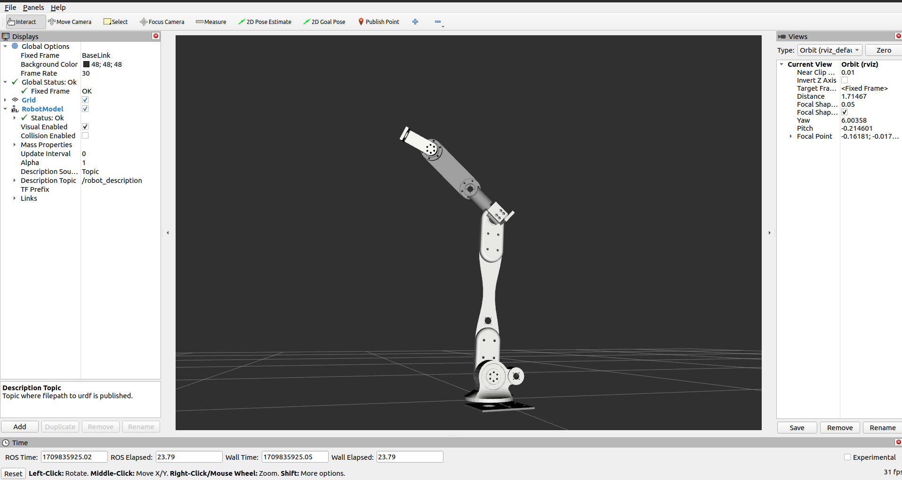

# vajra_manip_ros2 with moveit2 configurations

### this is the ros2 humble version of our rover manipulator

> tested in ROS humble on Ubuntu 22.04 LTS

> change the paths of the stl files in manipulator.urdf to load meshes in rviz2

> moveit2 configuration is added

